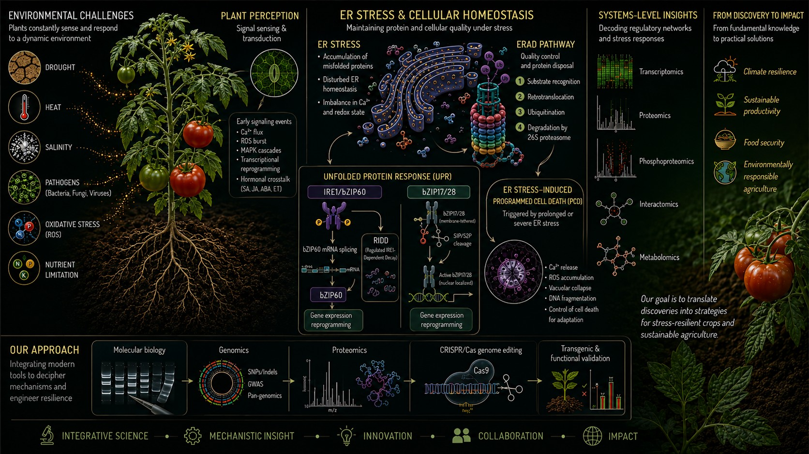
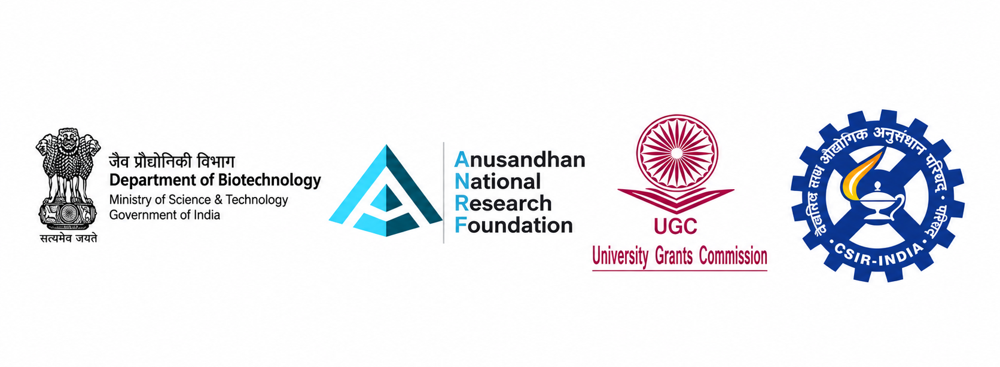

::: {style="text-align:center; margin-top:20px;"}

<h1 style="color:red; margin-top:5px; margin-bottom:5px;">
STRESS BIOLOGY LAB
</h1>

Department of Plant Science | School of Biological Sciences 
Central University of Kerala

:::

{width="100%"}

<!-- MAIN SECTION -->

<!-- ABOUT -->

<h2 style="color:#0b3d2e; border-bottom:2px solid #0b3d2e; display:inline-block;">
About the Lab
</h2>

SBL focuses on understanding plant physiology, stress responses, and the molecular mechanisms underlying plant growth, development, and adaptation to environmental challenges. Our research encompasses both biotic and abiotic stresses, with a major emphasis on endoplasmic reticulum (ER) stress, ER stress-induced programmed cell death (PCD), and ER-associated degradation (ERAD), which play crucial roles in maintaining cellular homeostasis and regulating plant stress responses. Tomato (<em>Solanum lycopersicum</em> L.) serves as a major model for investigating ER stress signaling and associated cell death pathways, complemented by research using <em>Arabidopsis thaliana</em>, <em>Nicotiana</em> species, and <em>Lathyrus</em> species.

We integrate plant physiology, molecular biology, genomics, proteomics, and genome-editing approaches to investigate stress-responsive pathways and uncover the regulatory networks governing cellular homeostasis, stress signaling, and plant resilience. Our research aims to elucidate the molecular interplay between ER stress, protein quality control, and programmed cell death, while also exploring the mechanisms underlying plant responses to diverse environmental stresses and their potential applications in crop improvement and sustainable agriculture.

<!-- NEWS -->

<h2 style="color:#0b3d2e; border-bottom:2px solid #0b3d2e; display:inline-block;">
Latest News!
</h2>

<ul style="padding-left:18px; line-height:1.9; font-size:15px;">

<li>🎉 Welcome to SBL, Vivek! He has joined as a JRF</li>
<li>🎉 Congrats Gayathri on becoming SRF!</li>
<li>🎉 We welcome Arun to SBL as a PhD student</li>
<li>🎉 We welcome Sruthi to SBL as a PhD student</li>
<li>👋 Dr. Kandoth has been promoted to Professor. Congratulations, Dr. Kandoth!</li>

</ul>

<!-- ANIMATION -->

<!-- FUNDING -->

<h2 style="color:#0b3d2e;">Funding</h2>

