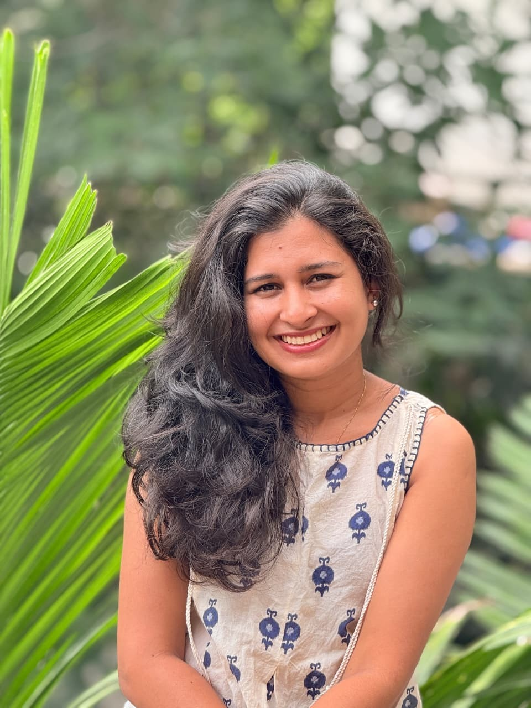
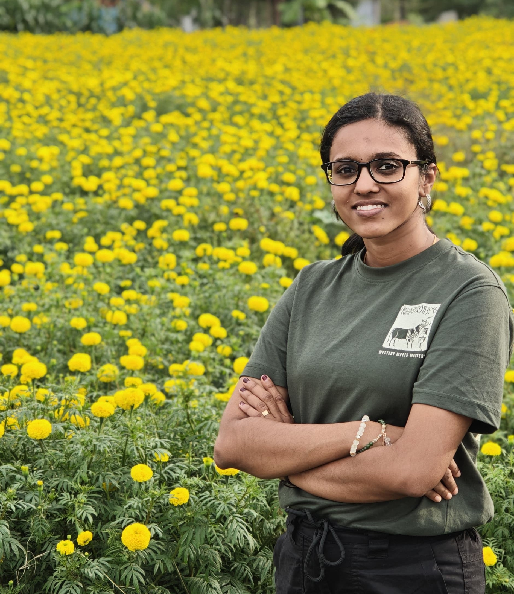
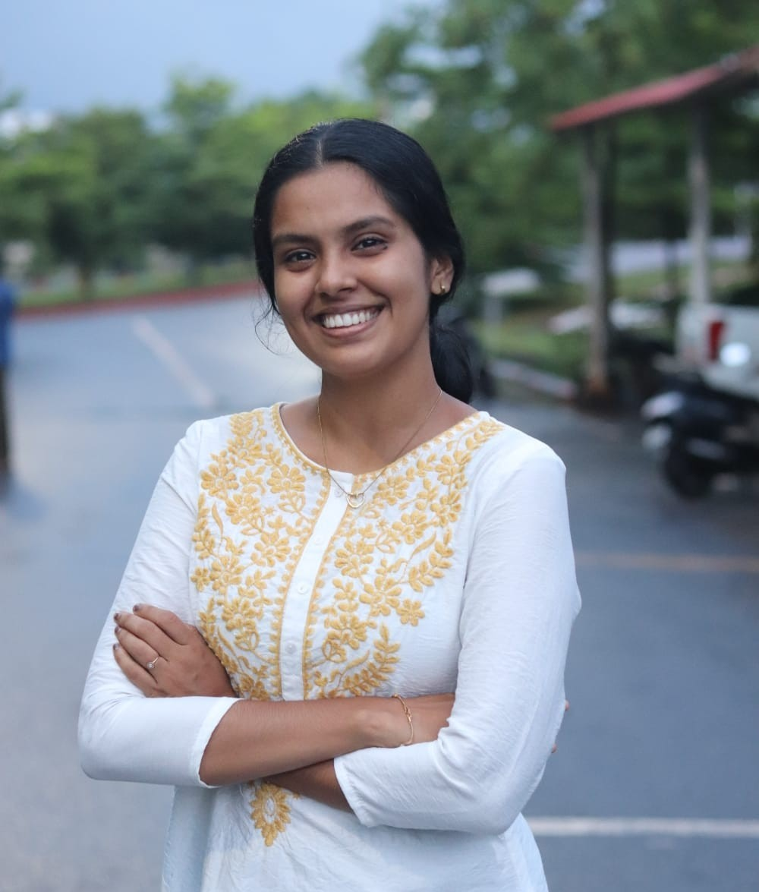
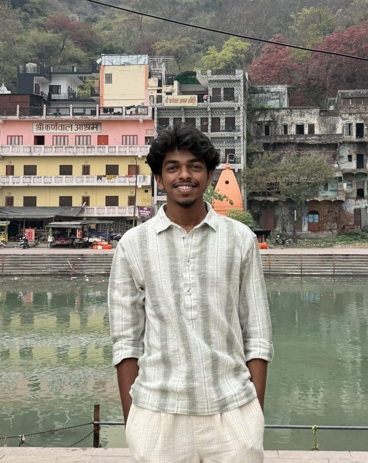
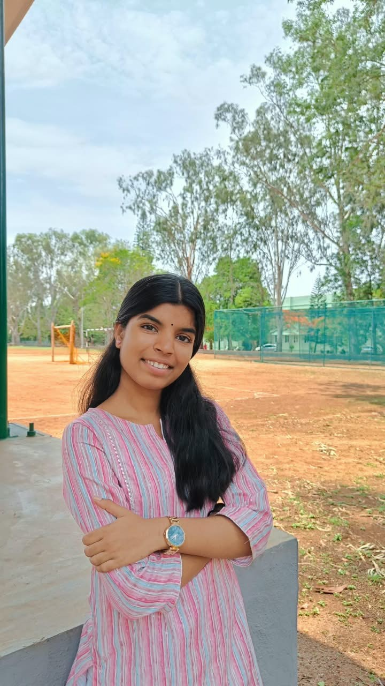
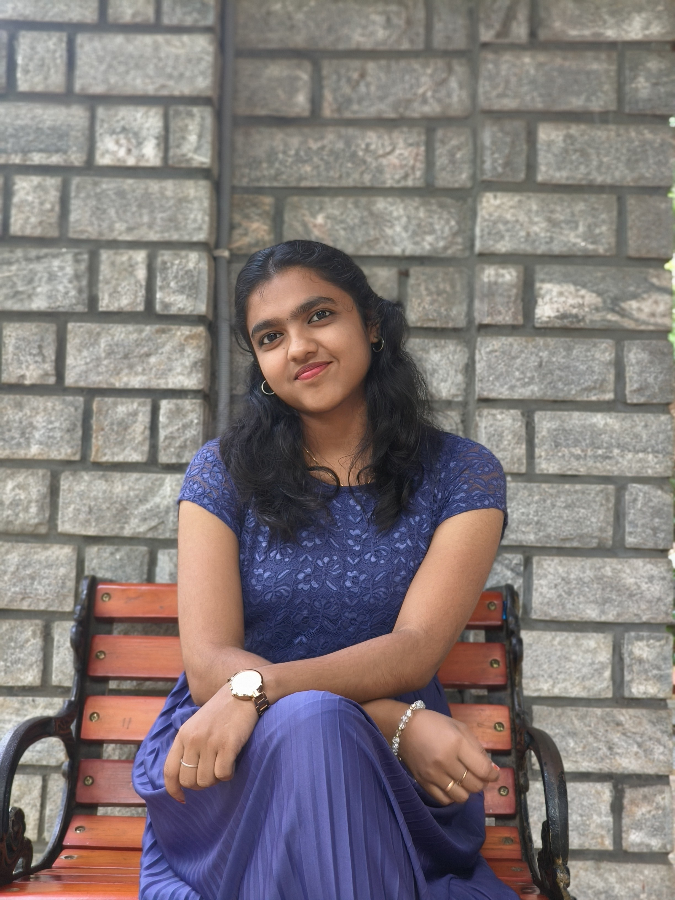

## PhD Students

<h4 style="margin:0; color:#0b3d2e;">Sreelekha A</h4>

<strong>CSIR SRF</strong>

She completed her MSc in Botany from Manglore University and now she is Working ER stress–induced programmed cell death (PCD) pathways in plants

📧 <a href="sreelekha.2301007002@cukerala.ac.in" style="color:#0b3d2e;">
sreelekha.2301007002@cukerala.ac.in
</a>

<h4 style="margin:0; color:#0b3d2e;">Gayathri V</h4>

<strong>UGC SRF</strong>

She completed her MSc in Botany from the University of Kerala and she is interested in understanding ER quality control in plants

📧 <a href="mailto:gayathrivenugopal1999@gmail.com" style="color:#0b3d2e;">
gayathrivenugopal1999@gmail.com
</a>

<h4 style="margin:0; color:#0b3d2e;">Sruthi C E</h4>

<strong>CSIR JRF</strong>

She completed her MSc in Botany from Mahatma Gandhi University, Kerala, and she is currently finalizing her research interests in ER stress biology

📧 <a href="mailto:sruthice06@gmail.com" style="color:#0b3d2e;">
sruthice06@gmail.com
</a>

<h4 style="margin:0; color:#0b3d2e;">Arun Kizhkkepurakkal</h4>

<strong>UGC JRF</strong>

He completed hid MSc in Botany from Central University of Kerala, and he is currently finalizing his research interests in ER stress biology

📧 <a href="mailto:arunkizhakkepurakkal@gmail.com" style="color:#0b3d2e;">
arunkizhakkepurakkal@gmail.com
</a>

## Junior Reasech Fellow

<h4 style="margin:0; color:#0b3d2e;">Vivek Adot</h4>

<strong>JRF</strong>

He completed his MSc in Botany from the Central University of Kerala and he is currently working on a project on ER stress–induced programmed cell death (PCD) pathways in plants

📧 <a href="mailto:vivekadot17@gmail.com" style="color:#0b3d2e;">
vivekadot17@gmail.com
</a>

## Dissertation Students (2026-2027)

 
<strong>Akshata</strong> 
<em>Master Student</em>

 
<strong>Aditya S</strong> 
<em>Master Student</em>

 
<strong>Arundhathi S</strong> 
<em>Master Student</em>

 
<strong>Skanda H</strong> 
<em>Master Student</em>

 
<strong>Ananya Suresh</strong> 
<em>Master Student</em>

## Alumni

### PhD Students
- **Dr. Ankita Rana**  (From BRIC-NABI)
- **Dr. **  (From BRIC-NABI)
- **Dr. **  (From BRIC-NABI)

### Master's Dissertation Students

  
<strong>Ayisha</strong>(2025–26)

  
<strong>Bhavya R</strong>(2025–26)

  
<strong>Devendra Dahake</strong>(2025–26)

  
<strong>Pavani M</strong>(2025–26)

  
<strong>Spoorthi M E</strong>(2025–26)

  
<strong>Aiswarya K</strong>(2024–25)

  
<strong>Arun Kizhkkepurakkal</strong>(2024–25)

  
<strong>Haneena P J</strong>(2024–25)

  
<strong>Kamal M J</strong>(2024–25)

  
<strong>Rishada M</strong>(2024–25)

  
<strong>Fehmi Basheer</strong>(2023–24)

  
<strong>Lanciya</strong>(2023–24)

  
<strong>Shasiya</strong>(2023–24)

  
<strong>Ujjwal Kumar Ghosh</strong>(2023–24)

  
<strong>Bharath</strong>(2022–23)

  
<strong>Dhanaleskshmi S</strong>(2022–23)

  
<strong>Itishree Priyadarshini Bhola</strong>(2022–23)

  
<strong>Pavitra B</strong>(2022–23)

### Interns
- **Manjima (2025)** – *Summer Intern*  
